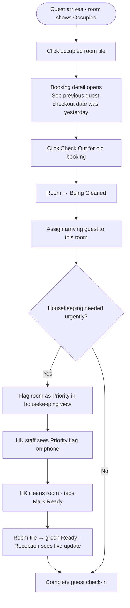

# UX Design Specification — Smeraldo Hotel

**Author:** Khoa
**Date:** 2026-02-14

---

<!-- UX design content will be appended sequentially through collaborative workflow steps -->

## Executive Summary

### Project Vision

Replace every Excel spreadsheet in a 23-room boutique hotel with a single, fast, reliable web app that 5 staff members actually want to use. Success isn't features — it's Linh completing check-in in under 90 seconds and Khoa seeing monthly occupancy in under 10 seconds. The system must be invisible in its reliability and obvious in its clarity.

### Target Users

| Persona | Device | Key Need | Tech Level |
|---------|--------|----------|------------|
| **Linh** (Reception, day/night shift) | Desktop/tablet | Fast check-in, zero errors, booking recovery | Intermediate |
| **Khoa** (Manager/Owner) | Phone + desktop | At-a-glance dashboards, monthly reports | Intermediate |
| **Housekeeping staff** | Phone | One-tap room status update, assigned rooms only | Basic |

### Key Design Challenges

1. **Dual-device reality** — reception needs a power-user desktop experience; housekeeping needs a one-thumb phone interface. Same app, radically different contexts requiring two distinct UI modes.
2. **Real-time trust** — if the room diagram ever shows stale data, staff won't trust it and will fall back to phone calls. The UI must make "this is live" feel obvious and instinctive.
3. **Speed over beauty** — this is a tool used under pressure (morning rush, late-night arrivals). Every extra tap is a failure. The 90-second check-in is the gold standard.

### Design Opportunities

1. **The room diagram as hero** — a beautifully designed, at-a-glance visual grid can become the "single source of truth" that anchors the whole experience and replaces the mental model of Excel grids.
2. **Role-tailored dashboards** — each role sees only what they need, making the app feel simple even though the underlying system is complex.
3. **Offline confidence** — visible offline mode indicators and local queue can build trust that the app will never lose data — something Excel never guaranteed.

## Core User Experience

### Defining Experience

The heart of Smeraldo Hotel Management is the **room diagram check-in flow** — used every day, every shift, under real time pressure. If this flow feels fast and reliable, the entire app feels fast and reliable. All other modules (attendance, inventory, reports) derive their UX quality from this central interaction model.

### Platform Strategy

- **PWA, desktop-first** with a dedicated mobile mode for housekeeping staff
- Primary input: mouse/keyboard for reception and manager; touch-first for housekeeping
- Offline capability is a hard requirement — graceful degradation with local queue and sync on reconnect
- Distributed via URL (no app store); installable as desktop shortcut and phone home screen icon
- Vietnamese locale (`vi-VN`) as default; VND currency, DD/MM/YYYY date format throughout

### Effortless Interactions

These actions must require zero cognitive effort — they should feel automatic:

- **Room status change** (housekeeping): one tap → status updated, reception sees it live
- **Check-in from booking**: guest name pre-filled → confirm → room turns green
- **Attendance logging**: visible grid of staff names → tap a value → auto-saved
- **Occupancy overview**: Khoa opens app → today's numbers are the first thing visible, no navigation needed

### Critical Success Moments

1. **First morning** — Linh checks in a guest in under 90 seconds without opening a single Excel file
2. **First real-time sync** — housekeeping taps "Ready" and reception sees the room flip to green with no phone call made
3. **First mobile check** — Khoa opens the app on his phone and sees correct occupancy without asking anyone

### Experience Principles

1. **"Glanceable first"** — Every screen answers the user's question before they tap anything
2. **"One action per moment"** — Each role's primary screen reduces to a single clear next action
3. **"Trust through transparency"** — Real-time indicators and audit trails make every staff member confident the data is true
4. **"Device-native comfort"** — Reception gets keyboard-friendly dense information; housekeeping gets large touch targets and minimal text

## Desired Emotional Response

### Primary Emotional Goals

**Primary goal: "Confident control"** — Staff should feel in command of the hotel floor. Not stressed, not hunting for information — every relevant piece of data is visible and the next action is always clear.

### Emotional Journey Mapping

| Moment | Desired Feeling |
|--------|----------------|
| Opening the app at shift start | *"I can see everything at a glance"* — calm readiness |
| Completing a check-in | *"Done. Next."* — clean, satisfying efficiency |
| Something going wrong (stale room status) | *"I can fix this"* — empowered, not panicked |
| Khoa checking the dashboard | *"I know what's happening"* — quiet confidence |
| Housekeeping tapping "Ready" | *"My job here is done"* — simple accomplishment |

### Micro-Emotions

- **Confidence over confusion** — the UI should never make staff second-guess what they're looking at
- **Trust over skepticism** — data must feel live and accurate, never stale or uncertain
- **Accomplishment over frustration** — completing a task should have a satisfying, definitive end state

### Design Implications

| Emotional Goal | UX Design Approach |
|---------------|-------------------|
| Confidence | Clear status labels with both color + text — never color-only |
| Trust | Live update indicators, "last synced" timestamps, real-time room diagram |
| Accomplishment | Subtle confirmation states — room tile turns green, check mark on completion |
| Avoid anxiety | Offline banner is informative and actionable, never alarming |
| Avoid frustration | Primary actions reachable in 1–2 taps maximum from any screen |

### Emotional Design Principles

- **Emotions to cultivate:** Confident, in-control, efficient, trusted
- **Emotions to avoid:** Anxiety (from unclear status), frustration (from multi-step flows), distrust (from stale data)
- The app should feel like a reliable colleague — always there, always accurate, never surprising in a bad way

## UX Pattern Analysis & Inspiration

### Inspiring Products Analysis

Drawn from PRD context — staff tech profile (intermediate), devices (desktop + Android/iOS), and Vietnamese hospitality context:

**Google Sheets (current tool being replaced)**
- *What works:* Familiar grid layout; staff already think in rows and columns
- *What fails:* No real-time sync, no role separation, manual formula maintenance, zero mobile usability
- *Lesson:* Preserve the visual density and grid mental model, but make it live and role-aware

**Grab / ride-hailing apps (familiar to Vietnamese users)**
- *What works:* Real-time status updates with clear color coding; one primary action per screen; status progression is visually obvious
- *Lesson:* Room diagram status transitions (Available → Occupied → Cleaning → Ready) should feel as clear and satisfying as a ride status update

**Hotel PMS systems (Cloudbeds, Little Hotelier)**
- *What works:* Room grid/calendar as the central navigation hub; color-coded availability
- *What fails:* Often complex, cluttered, built for large hotels — overwhelming for a 23-room boutique
- *Lesson:* Adopt the room grid paradigm but strip it to essentials — no feature bloat, no nested menus

### Transferable UX Patterns

**Navigation Patterns:**
- **Role-gated sidebar (desktop)** — different nav items per role, so each user only sees their world; mirrors how Grab shows different screens for drivers vs. riders
- **Bottom tab bar (mobile)** — housekeeping gets 2–3 tabs max: My Rooms, Done Today; no overwhelm

**Interaction Patterns:**
- **Tap-to-cycle status** — housekeeping taps a room tile to cycle through cleaning states, like toggling a task done in a checklist app
- **Inline check-in confirmation** — clicking a room on the diagram opens a focused modal (not a new page) with pre-filled guest info; one confirm tap completes the flow

**Visual Patterns:**
- **Color + label status badges** — green/amber/red/grey with text labels; WCAG-compliant and never ambiguous (PRD requirement)
- **Live pulse indicator** — subtle animated dot on real-time-connected elements signals "this is live data," building trust without visual noise

### Anti-Patterns to Avoid

- **Hamburger menus on desktop** — hides navigation; staff need to see where they are at all times
- **Full page reloads for status changes** — breaks the "live control panel" feel; everything must update in-place
- **Date pickers for common ranges** — attendance and reports should default to "today" and "this month" with one-tap shortcuts, not force users to open a calendar
- **Confirmation dialogs for every action** — only for destructive actions (cancel booking, override status); routine actions (check-in, mark ready) should be immediate with undo available
- **Feature-rich dashboards with 10+ widgets** — Khoa needs 3 numbers, not a BI dashboard

### Design Inspiration Strategy

**Adopt:**
- Grid-based room diagram as the central navigation hub (from PMS systems)
- Color + text status badges with live update indicators (from real-time apps)
- Role-gated navigation — each persona sees only their workspace

**Adapt:**
- Grab's "one primary action per screen" — adapted for desktop where more density is acceptable, but primary CTA always visually dominant
- Google Sheets grid familiarity — adapted into an interactive room calendar that feels familiar but works in real time

**Avoid:**
- PMS complexity and nested menu structures
- Consumer app animation-heavy interactions — this is a work tool; micro-animations only for status confirmation, not decoration

## Design System Foundation

### Design System Choice

**shadcn/ui + Tailwind CSS**

### Rationale for Selection

- **Small team velocity** — `npx shadcn@latest add dashboard-01` provides a working dashboard scaffold instantly; 1–2 developers cannot afford to build a design system from scratch
- **PWA bundle performance** — shadcn/ui is fully tree-shakeable; only shipped components are bundled, keeping PWA load times under the PRD's 3-second target
- **Accessibility built-in** — WCAG AA+ compliant components by default; satisfies NFR-A1 and NFR-A2 without extra effort
- **Dual layout flexibility** — Tailwind utility classes make the desktop-first + mobile housekeeping layout straightforward to implement and maintain
- **Data-dense components** — `Table`, `Badge`, `Dialog`, and `Card` components directly map to attendance grids, room status badges, check-in modals, and inventory cards

### Visual Design Tokens

| Token | Value | Usage |
|-------|-------|-------|
| Primary | `#1E3A8A` | Nav, headings, primary actions |
| Secondary | `#3B82F6` | Links, interactive states |
| Accent/CTA | `#CA8A04` | Check-in button, key CTAs |
| Background | `#F8FAFC` | Page background |
| Style | Soft UI Evolution | Subtle depth, modern shadows, WCAG AA+ |

### Typography

- **Fira Sans** — body text, UI labels, data tables (clean, readable at small sizes in dense screens)
- **Fira Code** — timestamps, booking IDs, numeric data fields

### Implementation Approach

- Scaffold with `shadcn/ui` blocks: `dashboard-01` for manager view, `Table` for attendance/inventory
- Tailwind CSS for layout, spacing, responsive breakpoints
- Custom room diagram component built on top of Tailwind grid — no off-the-shelf component fits this need
- CSS custom properties for design tokens to support future theme adjustments

### Customization Strategy

- Override shadcn default color tokens with Smeraldo navy/gold palette
- Extend Tailwind config with hotel-specific status colors: `room-available`, `room-occupied`, `room-cleaning`, `room-ready`
- Keep component customization minimal — only deviate from shadcn defaults when hotel-specific UX patterns require it

## Design Direction Decision

### Design Directions Explored

Six directions were generated and evaluated:

| # | Name | Description |
|---|------|-------------|
| 1 | Clean Command | Navy sidebar + white content + gold CTAs — classic hotel ops feel |
| 2 | Dark Command | Full dark theme + gold accents — night shift optimised |
| 3 | Warm Gold | Gradient sidebar + colored card borders — premium hotel aesthetic |
| 4 | Compact Operations | Top navigation bar + dense room layout — power-user focused |
| 5 | Card Dashboard | Icon-only sidebar + KPI cards + room grid — manager overview |
| 6 | Mobile Housekeeping | Phone-first + task cards + one-tap status — housekeeping role |

### Chosen Direction

**Direction 4: Compact Operations**

### Design Rationale

- **Top navigation bar** keeps all 5 modules (Rooms, Bookings, Attendance, Inventory, Reports) visible and one click away at all times — no hidden menus, no hunting
- **Maximum information density** on the room view — all floors visible without scrolling in the main grid, giving reception the full picture immediately
- **Horizontal floor rows** mirror the actual mental model of "Floor 3 has these rooms" — more intuitive than a flat grid
- **Toolbar with chip filters** (All Floors / F3 / F4 / F5...) allows instant floor isolation without leaving the page
- **Inline stat chips** (Occupied · Available · Checkout · Cleaning) provide at-a-glance counts in the same toolbar row — zero navigation needed
- Scales well to both **widescreen reception desktops** and smaller laptop screens
- The **Mobile Housekeeping view** (Direction 6) is retained as the separate mobile experience — it pairs with Direction 4's desktop shell

### Implementation Approach

- Top navbar: `h-12` fixed, navy background, active link underlined in gold
- Room grid: horizontal rows grouped by floor, compact tiles (`min-w-[80px]`)
- Stat strip: inline badge row between toolbar and room grid — no separate widget panel
- Responsive: below `768px`, collapse to bottom tab bar (housekeeping mobile mode)
- `shadcn/ui` components: `NavigationMenu` for top nav, `Badge` for status chips, `Dialog` for check-in modal

## User Journey Flows

### Journey 1: Morning Rush Check-In (Linh — Reception)


### Journey 2: Booking Error Recovery (Linh — Edge Case)



### Journey 3: End-of-Month Review (Khoa — Manager)


### Journey 4: Room Turnover (Housekeeping — Mobile)


### Journey 5: Late Arrival + Attendance Logging (Night Shift)


### Journey Patterns

| Pattern | Description | Used In |
|---------|-------------|---------|
| **Tile → Modal → Confirm** | Tap room tile → focused dialog with pre-filled data → single confirm action | Journeys 1, 2, 5 |
| **Live tile feedback** | Every status change reflects immediately on the room grid — no reload | Journeys 1, 2, 4 |
| **Tab navigation entry** | All journeys start from the top navigation bar — single consistent entry point | All journeys |
| **Role-gated views** | Housekeeping only sees My Rooms + Done + Profile — no financial or admin data | Journey 4 |
| **Progressive disclosure** | Room tile shows minimal info; click reveals full booking details | Journeys 1, 2 |

### Flow Optimization Principles

- **Minimize taps to value:** Check-in in 3 taps (tile → review → confirm); status update in 1 tap (housekeeping)
- **Pre-fill everything possible:** Guest name from booking, dates from reservation — reception confirms, doesn't type
- **Destructive actions only get confirmation dialogs:** Check-out, cancel booking, status override — routine actions (check-in, mark ready) are immediate
- **Error recovery is always one step:** Wrong room? Cancel dialog and tap a different tile. Stale status? Override button always visible on tile detail
- **Offline state is explicit:** Banner shows "Offline — changes queued" — staff know their taps are being saved locally

## Component Strategy

### Design System Components (shadcn/ui)

| Need | shadcn Component | Journey |
|------|-----------------|---------|
| Check-in confirmation popup | `Dialog` | 1, 2, 5 |
| Status filter chips | `Badge` / `Button` group | All |
| Attendance data table | `Table` | 3, 5 |
| Inventory list | `Table` + `Badge` | 3 |
| Login form | `Form` + `Input` + `Button` | Auth |
| Toast/push notifications | `Toast` | 2, 4 |
| Alert banners (offline, low stock) | `Alert` | System |
| Top navigation | `NavigationMenu` | All |
| Dropdown menus | `DropdownMenu` | Nav, actions |
| Date inputs | `Calendar` / `DatePicker` | Booking form |

### Custom Components

#### RoomTile
- **Purpose:** Visual room status tile — the core interactive element of the room diagram
- **Content:** Room number (Fira Code), guest name if occupied, status color border + background
- **States:** `available` · `occupied` · `checkout` · `cleaning` · `ready` · `hover` · `selected`
- **Actions:** Click/tap to open CheckInDialog
- **Accessibility:** `role="button"`, `aria-label="Room 301 – Occupied, Nguyen Van A"`, fully keyboard focusable

#### RoomGrid
- **Purpose:** Floor-grouped layout of RoomTile components with live WebSocket/SSE sync
- **Content:** All rooms for selected floor(s), grouped under floor labels
- **States:** `loading` · `live` · `offline` (muted tiles with offline banner)
- **Actions:** Floor filter via toolbar chips; individual tile click
- **Behaviour:** Tiles update in-place on status change — no full grid re-render

#### CheckInDialog
- **Purpose:** Focused check-in / check-out / status override modal (extends shadcn `Dialog`)
- **Content:** Room number, guest name (pre-filled from booking), dates, booking source badge, nights auto-calculated
- **States:** `check-in` · `check-out` · `edit-booking` · `override-status`
- **Actions:** Confirm · Edit details · Cancel
- **Validation:** Dates logical; guest name required; destructive actions (check-out, override) require explicit confirm

#### HousekeepingRoomCard
- **Purpose:** Task card for housekeeping mobile view — replaces dense grid with touch-optimised cards
- **Content:** Room number, room type, status label, priority flag if set by reception
- **States:** `needs-cleaning` · `in-progress` · `done` · `priority`
- **Actions:** Start Cleaning · Mark Ready (one-tap primary CTA, min 48px touch target)
- **Accessibility:** Large touch targets, `aria-label` with room number and available action

#### LiveStatusIndicator
- **Purpose:** Communicates real-time connection state — builds staff trust in data accuracy
- **Content:** Animated pulse dot + "Live · Updated just now" / "Offline — X changes queued"
- **States:** `live` (green pulse) · `syncing` (amber) · `offline` (grey + queue count badge)
- **Placement:** Top navbar right side — always visible to all roles

### Component Implementation Strategy

- All custom components built with Tailwind utility classes and shadcn design tokens
- Custom components accept the same `className` prop pattern as shadcn for consistency
- Status colors defined as Tailwind config extensions (`room-available`, `room-occupied`, etc.)
- Components are server-component safe where possible; real-time ones are client components

### Implementation Roadmap

| Phase | Components | Blocks |
|-------|-----------|--------|
| **Phase 1 — Core** | `RoomTile`, `RoomGrid`, `CheckInDialog`, `LiveStatusIndicator` | All 5 user journeys |
| **Phase 2 — Supporting** | `HousekeepingRoomCard`, attendance table, booking form | Housekeeping + night shift journeys |
| **Phase 3 — Polish** | Notification toasts, offline banner, low-stock alert, progress bar | Full MVP quality |

## UX Consistency Patterns

### Button Hierarchy

| Level | Style | Usage | Example |
|-------|-------|-------|---------|
| **Primary** | Navy fill `bg-[#1E3A8A]` | One per screen — the dominant action | "Confirm Check-In" |
| **CTA** | Gold fill `bg-[#CA8A04]` | High-urgency actions in topbar | "Check In Guest" |
| **Secondary** | Outlined navy | Supporting actions | "Edit Booking", "+ New Booking" |
| **Ghost** | Text only | Low-priority, reversible | "Cancel", "Close" |
| **Destructive** | Red fill | Data-changing / irreversible | "Cancel Booking", "Override Status" |

Rule: Never two primary buttons on the same view. Ghost is always for dismissal only.

### Feedback Patterns

| Situation | Pattern | Duration |
|-----------|---------|---------|
| Check-in confirmed | Room tile color transition + `Toast` "Room 301 checked in" | Auto-dismiss 3s |
| Room marked Ready | Tile flips to green + `Toast` to reception | Auto-dismiss 3s |
| Form submit in progress | Button shows spinner + disabled state | Until response |
| Low stock alert | `Alert` banner (amber) at top of inventory page | Persistent until dismissed |
| Offline detected | `Alert` banner (grey) "Offline — changes queued (3)" | Persistent while offline |
| Error (network, conflict) | `Toast` (red) with specific message + retry action | Persistent until dismissed |

- Skeleton screens (`animate-pulse`) for initial data loads
- Spinners only for triggered async actions > 300ms
- Never leave the UI frozen with no feedback (severity: High per skill guidelines)

### Form Patterns

- Validation on `blur` for individual fields; full re-validation on submit
- All inputs have visible `<label>` elements — never placeholder-only (WCAG A requirement)
- Error messages appear below the field, specific ("Guest name is required" not "Error")
- Date fields default to today (check-in) and tomorrow (check-out) — one click to change
- Booking source is a `Select` with fixed options: Agoda · Booking.com · Trip.com · Facebook · Walk-in
- Long-stay toggle: checkbox "Long stay (30+ days)" reveals duration field inline

### Navigation Patterns

- **Desktop:** Fixed top navbar `h-12`, active module underlined in gold — no hamburger menu
- **Mobile (housekeeping):** Bottom tab bar, 3 tabs max, active tab filled navy
- Active state uses gold underline (desktop) or fill (mobile) — never bold text only
- No breadcrumbs — app is shallow (max 2 levels: module → detail)
- Browser back button always works via `history.pushState()`

### Modal and Overlay Patterns

- `CheckInDialog` opens centered, backdrop `bg-black/50`, closes on Escape or Cancel
- No nested modals — inline state changes within the same dialog for secondary confirmations
- Dialogs are never full-screen on desktop; on mobile they slide up as bottom sheets
- Destructive confirmation uses explicit labelled button ("Yes, check out") — no ambiguous "OK"

### Empty States and Loading

- Empty room floor: "No rooms found for this filter" with clear filter reset link
- No bookings: "No upcoming check-ins today" — informative, not alarming
- `RoomGrid` initial load: pulsing skeleton tiles in exact grid layout (`animate-pulse`)
- Attendance table: always shows month header + staff rows even when values are empty (defaults to 0)

## Responsive Design & Accessibility

### Responsive Strategy

Two fundamentally different layouts from the same codebase, switched at the `md` breakpoint (768px):

| Role | Primary Device | Layout Mode |
|------|---------------|-------------|
| Reception (Linh) | Desktop 1280px+ | Full top-nav + dense room grid, all floors visible |
| Manager (Khoa) | Phone + desktop | Dashboard KPIs immediately visible without navigation |
| Housekeeping | Android / iPhone | Bottom tab bar + task card list, full-width single column |

### Breakpoint Strategy

Desktop-first implementation using Tailwind responsive prefixes:

| Breakpoint | Size | Layout |
|------------|------|--------|
| Default (`lg`) | 1024px+ | Full desktop: top navbar, multi-column room grid |
| `md` | 768px–1023px | Tablet: compact room grid, condensed topbar |
| `sm` / base | < 768px | Mobile: bottom nav, single-column task cards |

**Key responsive behaviours:**
- `< 768px` → top navbar hidden; bottom tab bar (3 tabs) appears
- `< 768px` → `RoomGrid` becomes vertically scrollable single-column card list
- `< 768px` → `CheckInDialog` becomes bottom sheet (slides up from bottom edge)
- `< 768px` → Attendance table gets horizontal scroll
- Room tiles: `min-w-[80px]` compact on desktop; full-width card on mobile
- Room diagram supports both landscape and portrait on mobile (PRD requirement)

### Accessibility Strategy

Target: **WCAG 2.1 Level AA** — satisfies NFR-A1 and NFR-A2

| Requirement | Implementation |
|-------------|---------------|
| Color contrast | 4.5:1 minimum body text; 3:1 large text and UI components |
| Status indicators | Color + text label always — never color-only |
| Touch targets | Minimum 48×48px for all tappable elements on mobile |
| Keyboard navigation | All elements reachable via Tab; logical focus order throughout |
| Focus indicators | `focus-visible` ring on all interactive elements |
| Screen reader | Semantic HTML (`<nav>`, `<main>`, `<button>`); ARIA labels on icon-only buttons |
| Reduced motion | `prefers-reduced-motion` suppresses tile transitions and pulse animations |
| Form labels | All inputs have associated `<label>` — no placeholder-only fields |

### Browser Testing Matrix

| Platform | Browser | Priority |
|----------|---------|---------|
| Desktop | Chrome, Firefox, Edge | Primary — reception + manager |
| Android | Chrome | Secondary — housekeeping |
| iPhone / iPad | Safari | Secondary — housekeeping |

### Implementation Guidelines

- Tailwind responsive prefixes (`md:`, `lg:`) throughout — no custom CSS media queries
- Font sizes in `rem`; `px` acceptable for fixed-height structural elements (navbar `h-12`)
- All images have `alt` text; decorative icons use `aria-hidden="true"`
- Skip link `<a href="#main-content">` as first focusable element on every page
- `<button>` for all interactive room tiles — never `<div onClick>`
- VND formatting: `Intl.NumberFormat('vi-VN', { style: 'currency', currency: 'VND' })`
- Date formatting: `Intl.DateTimeFormat('vi-VN')` → outputs `DD/MM/YYYY` Vietnamese locale
- Responsive test breakpoints: 375px, 768px, 1024px, 1440px

## Core User Interaction

### Defining Experience

> **"Tap a room → see who's in it → act on it."**

This is the defining loop. From a single room tile interaction, staff can check-in, check-out, override status, and trigger housekeeping — everything flows from the room diagram. If this interaction is fast and reliable, the entire product succeeds.

### User Mental Model

Staff currently think in Excel rows, but their *actual* mental model is a **physical floor plan** — "Floor 5, room 501 is empty, 502 is occupied." The room diagram honours that spatial thinking rather than forcing staff into tabular navigation.

**Current fragmented flow (Excel):** open spreadsheet → scan rows → cross-reference another tab → call housekeeping to verify status

**New unified flow (Smeraldo):** open app → see live floor grid → all information and actions available on the tile

### Success Criteria

- Linh identifies the right room, confirms check-in, and closes the modal in **under 90 seconds** — cold start, no training
- Housekeeping taps a room tile → status changes → reception sees the update within **3 seconds** — zero phone calls
- Khoa reads today's occupancy from the room diagram without opening any sub-page

### Novel vs. Established Patterns

The core interaction borrows from proven patterns — no novel UX education required:

- **Hotel PMS grid** (adopted) — rows of rooms with status colors; familiar to any hotel staff
- **Kanban board** (adapted) — rooms move through status states like task cards move through columns
- **Trello/Linear task tiles** (adapted) — tapping a tile reveals detail and actions in a focused modal

The innovation is combining **real-time sync + role-aware views + mobile/desktop parity** in a single simple interface — not inventing a new interaction paradigm.

### Experience Mechanics

**The Check-In Flow (primary defining interaction):**

| Stage | What Happens |
|-------|-------------|
| **Initiation** | Linh sees the room diagram. Available rooms show floor/number. She spots the arriving guest's room. |
| **Interaction** | Tap/click the room tile → focused modal opens showing: guest name (pre-filled from booking), check-in/out dates, booking source. Single "Confirm Check-In" CTA. |
| **Feedback** | Room tile instantly transitions to green (Occupied). Guest name appears on tile. Modal closes. No page reload. |
| **Completion** | Linh returns to the live room diagram showing the updated state. Total: ~5 taps, under 90 seconds. |

## Visual Design Foundation

### Color System

**Brand Palette — Hotel/Hospitality:**

| Role | Name | Hex | Usage |
|------|------|-----|-------|
| Primary | Navy | `#1E3A8A` | Sidebar, nav, headings, primary buttons |
| Secondary | Sky Blue | `#3B82F6` | Links, secondary actions, highlights |
| Accent/CTA | Gold | `#CA8A04` | Check-in button, key CTAs, important badges |
| Background | Off-white | `#F8FAFC` | Page background |
| Body Text | Dark Navy | `#1E40AF` | Standard body text |
| High-contrast Text | Slate | `#0F172A` | Headings, high-contrast labels |

**Room Status Color Tokens (custom Tailwind):**

| Status | Color | Hex | Token |
|--------|-------|-----|-------|
| Available | Emerald | `#10B981` | `room-available` |
| Occupied | Blue | `#3B82F6` | `room-occupied` |
| Checking Out Today | Amber | `#F59E0B` | `room-checkout` |
| Being Cleaned | Violet | `#8B5CF6` | `room-cleaning` |
| Ready | Green | `#22C55E` | `room-ready` |

All status colors are paired with text labels — never color-only (WCAG 2.1 compliance, NFR-A2).

### Typography System

**Font Pairing: Fira Family (Dashboard Data)**

- **Fira Sans** — all UI labels, navigation, body text, table cells
- **Fira Code** — timestamps, booking IDs, room numbers, VND currency amounts

```css
@import url('https://fonts.googleapis.com/css2?family=Fira+Code:wght@400;500;600;700&family=Fira+Sans:wght@300;400;500;600;700&display=swap');
```

**Tailwind Config:**
```js
fontFamily: { mono: ['Fira Code', 'monospace'], sans: ['Fira Sans', 'sans-serif'] }
```

**Type Scale:**

| Level | Size | Weight | Usage |
|-------|------|--------|-------|
| H1 | 24px | 600 | Page titles |
| H2 | 20px | 600 | Section headings |
| H3 | 16px | 500 | Card titles |
| Body | 14px | 400 | Table rows, form labels |
| Small | 12px | 400 | Timestamps, meta info |
| Data | 14px mono | 500 | Room numbers, IDs, VND amounts |

### Spacing & Layout Foundation

- **Base unit:** 8px — all spacing in multiples (8, 16, 24, 32, 48, 64)
- **Desktop layout:** Fixed sidebar (240px) + fluid main content area, max-width `1280px` (`max-w-7xl`)
- **Mobile layout:** Bottom tab bar + full-width content, 16px horizontal padding
- **Content density:** Medium-dense — data tables use 8px row padding; cards use 16px internal padding
- **Style:** Soft UI Evolution — subtle box shadows, modern depth, no harsh borders

**Layout Grid:**
- Desktop: 12-column grid, 24px gutters
- Mobile: 4-column grid, 16px gutters
- Sidebar: fixed 240px on desktop, hidden on mobile (replaced by bottom nav)

### Accessibility Considerations

- Minimum contrast ratio: 4.5:1 for body text, 3:1 for large text and UI components (WCAG 2.1 AA)
- Focus rings visible on all interactive elements using `focus-visible` pseudo-class
- All status indicators use both color and text label — never color-only
- Font sizes no smaller than 12px for any readable content
- `prefers-reduced-motion` media query respected for all transitions and animations
